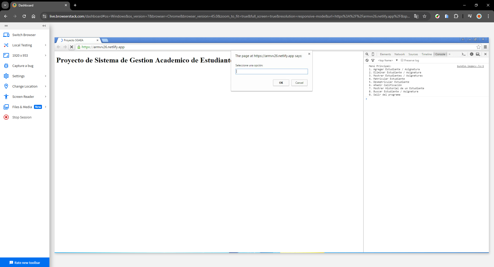
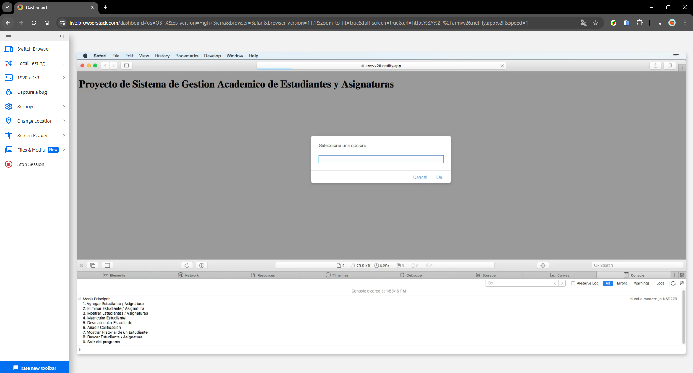

# Tarea 4.5 - Polyfill y Transpile
> ---
> ## Enunciado
> Install and configure node, webpack and babel to polyfill and transpile your code so it runs in older browsers. 
>
> ---

## Documentación
En este apartado voy a documentar los pasos que he seguido para implementar **Polyfill** y **Transpile** en el proyecto:

### 1. Conceptos
Antes de implementar **Polyfill** y **Transpile**, es necesario aclarar estos conceptos:
- **Polyfill**: Es una pieza de código que añade soporte para funcionalidades que no están disponibles en navegadores más antiguos.
- **Transpile**: Convierte código moderno (*ES6+*) a una versión más antigua de *JavaScript* para que sea compatible con navegadores más antiguos.

### 2. Herramientas (Paquetes)
Lo primero que hay que hacer es instalar las herramientas (paquetes) necesarias para poder implementar **Polyfill** y **Transpile**:
1. **Webpack**: Herramienta que permite empaquetar el código y todas las dependencias del proyecto.
    - **webpack-cli**: Proporciona un set de comandos para configurar *Webpack*.
    - **webpack-merge**: Proporciona la función *merge* que permite combinar configuraciones de *Webpack*.
    - **copy-webpack-plugin**: Permite copiar un archivo (en este caso un *HTML*) de un directorio a otro usando *Webpack*.
2. **Babel**: Permite transpilar el código.
    - **babel-loader**: Permite usar *Babel* con *Webpack* para transpilar el código.
    - **@babel/core**: Núcleo de *Babel*.
    - **@babel/present-env**: Configuración de *Babel* que permite convertir código moderno en función del navegador objetivo.
3. **Core-js**: Biblioteca que añade *Polyfills* al proyecto.
4. **Cross-env**: Permite ejecutar scripts que usan variables de entorno.
5. **Regenerator-runtime**: Sirve para compilar/transpilar las funciones *async*.

Para instalar todas estas herramientas (paquetes) he usado el siguiente comando:
```bash
npm install --save-dev webpack wepback-cli webpack-merge html-webpack-plugin
npm install --save-dev babel-loader @babel/core @babel/present-env
npm install --save-dev core-js cross-env regenerator-runtime
```

> ***NOTA***: Es necesario tener en cuenta que para realizar de forma correcta esta tarea es necesario haber hecho la configuración e instalación de las anteriores tareas con sus respectivas herramientas y paquetes.

### 3. *Index.html*
Para poder comprobar el funcionamiento de los archivos transpilados / compilados que vamos a generar con *Webpack* es necesario asociar estos scripts a un `index.html`. Para ello lo que vamos a hacer es un archivo `index.html` en el que vamos a incluir los dos scripts que vamos a generar. El contenido del `index.html` es:
```html
<!DOCTYPE html>
<html lang="en">
<head>
    <meta charset="UTF-8">
    <meta name="viewport" content="width=device-width, initial-scale=1.0">
    <title>Proyecto SGAEA</title>
    <script defer type="module" src="bundle.modern.js"></script>
    <script defer src="bundle.legacy.js"></script>
</head>
<body>
    <h1>Proyecto de Sistema de Gestion Academico de Estudiantes y Asignaturas</h1>
</body>
</html>
```
Cuando generemos los arcvhios `bundle.x.js`, el archivo `index.html` se copiara en las respectivas carpetas que se van a generar, para posteriormente comprobar su funcionalidad.


### 4. *Webpack*
Para configurar *Webpack*, es necesario crear 3 ficheros:
- `webpack.common.js`: Define la configuración común para el desarrollo y la producción. El contenido es:
```js
import CopyWebpackPlugin from 'copy-webpack-plugin';
import path from 'path';

export default {   
    entry: './src/main.js',
    output: {
        path: path.resolve(process.cwd(), 'compilado', process.env.modo),
        filename: 'bundle.js',
        // Dos modos de "compilacion": desarrollo y produccion.
        // Minifying
    },
    mode: process.env.modo, // De que modo queremos que compile.

    // Plugin para copiar un HTML con webpack
    plugins: [
        new CopyWebpackPlugin({
            patterns: [
                { from: './src/index.html', to: '.' }, // Copia el index.html al directorio base (development o production)
            ],
        }),
    ],
}
```

- `webpack.legacy.js`: Permite generar una versión del *Bundle* compatible con navegadores antiguos. El contenido es:
```js
import path from 'path';
import { merge } from 'webpack-merge'; // Permite combinar archivos entre webpack.common y el .legacy
import common from './webpack.common.js'; // Se importa la configuración común.

export default merge(common, {
    output: {
        filename: 'bundle.legacy.js', // Nombre del archivo de salida
    },
    module: { 
        rules:  [
            {
                test: /\.js$/, // Aplica esta regla a todos los archivos *.js
                exclude: /node_modules/, // Excluye a los archivos de node_modules
                use: {
                    loader: 'babel-loader', // Se usa babel para transpilar el código
                }
            },
        ],
    },
});
```

- `webpack.modern.js`: Permite generar una versión *Bundle* optimizada para navegadores modernos. El contenido es:
```js
import path from 'path';
import { merge } from 'webpack-merge'; // Permite combinar archivos entre webpack.common y el .modern
import common from './webpack.common.js'; // Se importa la configuración común.

export default merge(common, {
    output: {
        filename: 'bundle.modern.js', // Nombre del archivo de salida
    },
    module: { 
        rules:  [
            {
                test: /\.js$/, // Aplica esta regla a todos los archivos *.js
                exclude: /node_modules/, // Excluye a los archivos de node_modules
                use: {
                    loader: 'babel-loader', // Se usa babel para transpilar el código
                }
            },
        ],
    },
});
``` 

### 5. *Babel*
Por otro lado, para configurar *Babel* es necesario crear un archivo de configuración llamado `babel.config.js`, donde se define cómo *Babel* debe de transpilar el código en función de los navegadores objetivo. El contenido es:
```js
export default {   
    presets: [
        [
            "@babel/preset-env",
            {
                 targets: "> 0.25%, firefox>10, chrome>10, safari>10, not dead", // Esto es para la version de navegadores que queremos que soporte.
                useBuiltIns: "usage", // Incluya solo los polyfills que necesitamos.
                corejs: 3 // Version de corejs que estamos usando.
            }
        ]
    ]
}
```

### 6. Creación de los scripts
Una vez instalados y configurados los diferentes paquetes y archivos, lo que hay que crear son los *scripts* necesarios para realizar el proceso. Para ello nos vamos al apartado de *scripts* del archivo `package.json` y ponemos lo siguiente:
```json
"antiguo": "cross-env-shell webpack --config webpack.legacy.js --mode $modo",
"moderno": "cross-env-shell  webpack --config webpack.modern.js --mode $modo",
"des": "cross-env-shell modo=development run-s antiguo moderno",
"prod": "cross-env-shell modo=production run-s antiguo moderno",
"limpia:com": "rimraf compilado",
"generar:bundle": "run-s limpia:com des prod"
```
- ***antiguo***: Ejecuta *Webpack* usando la configuración definida en `webpack.legacy.js` para generar un *Bundle* compatible con navegadores antiguos. La variable **$modo** define el modo de compilación (**development** o **production**).
- ***moderno***: Hace lo mismo que el comando anterior, pero usando la configuración definida en `webpack.modern.js` para generar un *Bundle* para navegadores modernos.
- ***des***: Ejecuta los scripts ***antiguo*** y ***moderno*** en modo **development**.
- ***prod***: Lo mismo que el anterior, pero en modo **production**.
- ***limpia:com***: Elimina la carpeta `compilado`, que es la carpeta generada.
- ***generar:bundle***: Ejecuta el script ***limpia***, después ***des*** y por último ***prod***

> ***DETALLES TÉCINCOS***:
> - *cross-env-shell*: Permite definir variables de entorno de forma compatible en todos los SO.
> - *webpack --config webpack.x.js*: Especifica qué configuración usar de *Webpack*.
> - *--mode $mode*: Define si el *Bundle* está generado en formato *development* o *production*.
> - *modo=x*: Variable de entorno con el valor indicado.
> - *run-s*: Permite ejecutar scripts de forma secuencial (*npm-run-all*).  


### 7. Generar y comprobar resultado
Teniendo los *scripts* ya definidos en el archivo `package.json`, ahora lo que tenemos que hacer es:
1. Abrir una terminal. En mi caso, uso la terminal de *Git bash* de *Visual Studio Code*.
2. Entramos en la carpeta donde estén todos los archivos que acabamos de crear y ejecutamos el comando:
```bash
npm run generar-bundle
```

3. Esto generará la carpeta `compilado` y dentro de esta habrá dos carpetas que contendrán los mismos ficheros (`bundle.legacy.js`, `bundle.modern.js` e `index.html`) pero diferentes:
    - `development`: Los *Bundles* de este archivo estarían sin minificar (código más legible). 
    - `production`: Mientras que estos sí estarían minificados (código compacto y optimizado).

4. Por último, para comprobar el resultado, se tendría que hacer usando un *live-server* (Explicado en la [Tarea 4.4 - Modulos](https://github.com/ArmVV26/DWEC_Proyecto_SGAEA/tree/main/js/2%C2%BA%20Trimestre/Tarea%204.4%20-%20Modulos#3-comprobar-funcionalidad)). Para ello:
   4.1. Nos iremos dentro del archivo `compilado/production`.
   4.2. Ejecutamos el siguiente comando que nos abrirá una pestaña en nuestro navegador principal con el `index.html` que tiene asociado los `Bundle`.      
```bash
live-server
```

### 8. Comprobar resultado con BrowserStack y Netlifly
Para comprobar que está optimizado para navegadores antiguos, vamos a usar *Netlifly* para desplegar una web y *BrowserStack* para probar esta web en diferentes navegadores y versiones.
El ***Proceso para Crear la Web*** con *Netlifly* es simple:
1. Entramos en [Netlifly](https://www.netlify.com/) y seleccionamos la opción que pone **Deploy to Netlifly**.
2. Iniciamos sesión con *GitHub*.
3. Seleccionamos la opción **Deploy a new site** e indicamos el repositorio que vamos a usar.
4. En la configuración indicamos un nombre y en la opción que pone **Publish Directory** le indicamos la ubicación del fichero `index.html` que queremos usar.

5. Una vez indicado esto, le damos a **Deploy Site** y esperamos a que la página se despliegue.


Para ***Comprobar con Navegadores Antiguos*** usando *BrowserStack* hay que hacer lo siguiente:
1. Iniciamos sesión con alguna cuenta de *Google*.
2. Ahora le indicaremos el navegador que queramos y la versión que queremos usar.
3. Se inciará la opción que elijamos. Cuando se inicie, solamente tendremos 1 minuto para probarlo, por lo que hay que hacer la comprobación rápido.
4. Cuando se inicie, pegamos la URL de nuestro sitio web de *Netlifly* y comprobamos si funciona o no.

En mi caso, he probado con ***Google Chrome V. 45***, ***Safari V. 11.1*** y ***Firefox V. 30***. Las capturas están en ese orden.




---

## Funcionamiento
Para compilar/transpilar el proyecto, es necesario seguir los siguientes pasos:
1. Descargar los archivos `jsdoc.json`, `package.json`, la carpeta `src`, `babel.config.js`, `webpack.common.js`, `webpack.legacy.js` y `webpack.modern.js`.
2. Abrir carpeta donde te lo has descargado con Visual Studio Code y abrir una terminal *Bash*.
3. Ejecutar el comando:
```bash
npm install
```
Esto hará que se descarguen todas las dependencias que están indicadas en `package.json`.

4. Una vez todo descargado, ejecutar el comando:
```bash
npm run generar-bundle
```
5. Esto generará la carpeta `compilado` donde se podrán ver y comprobar los *Bundles* generados.