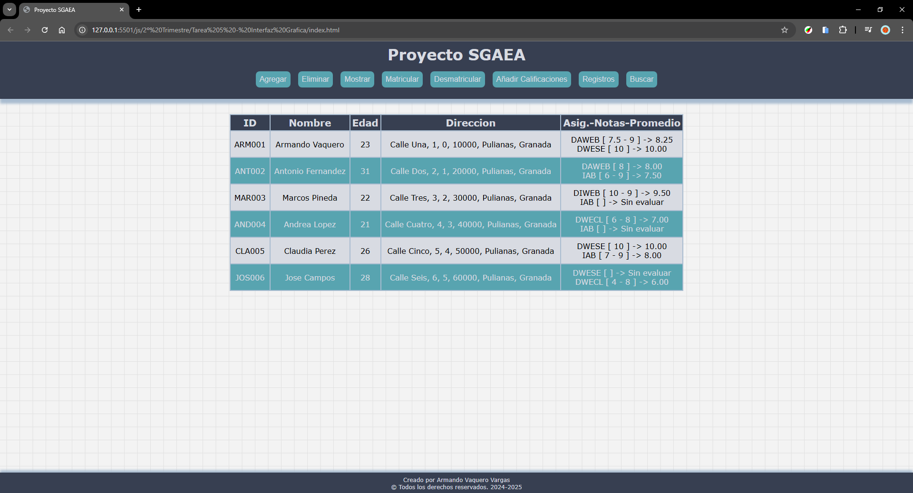
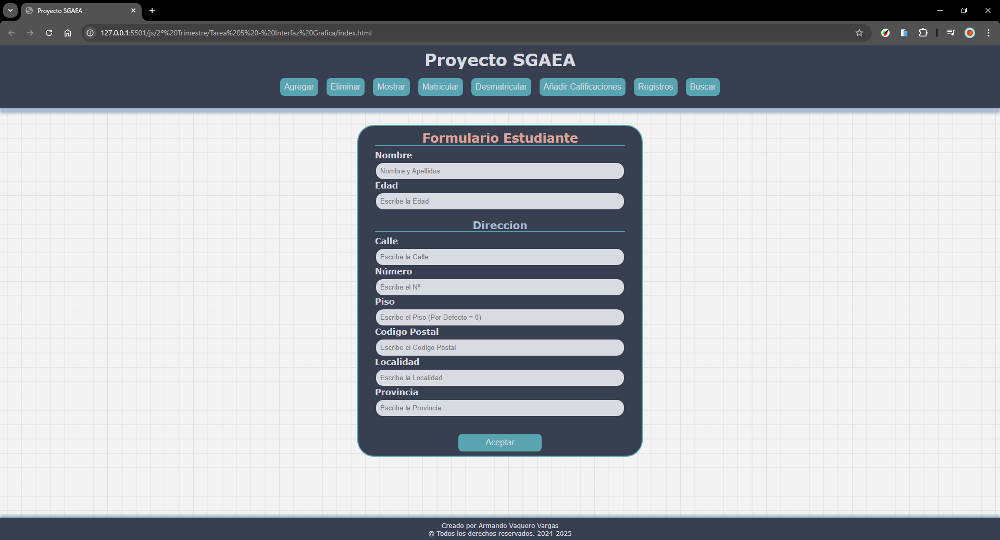
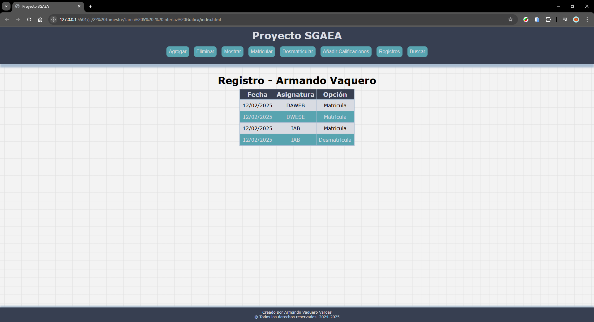
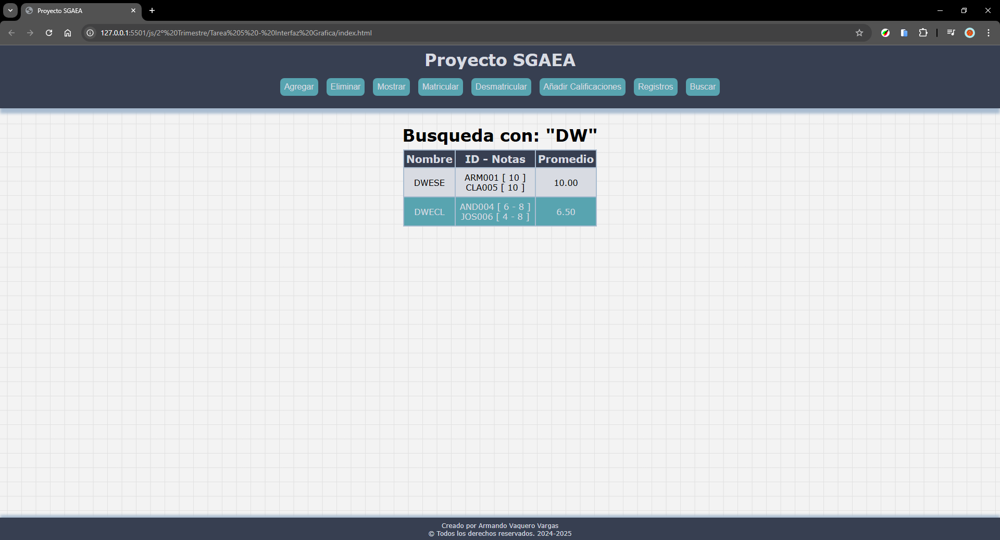
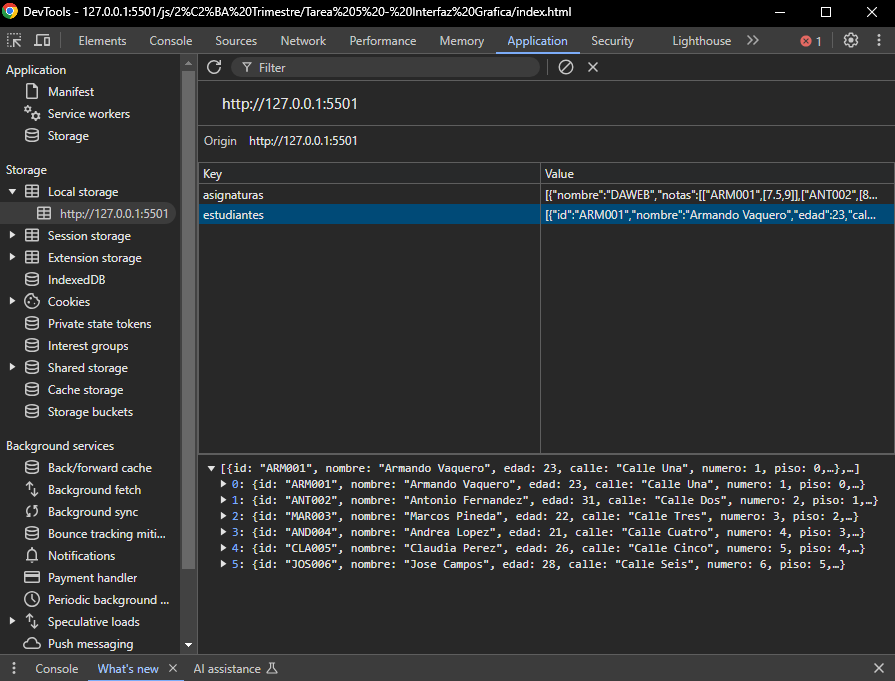

# Tarea 5 - Crear una Interfaz Gráfica
> ---
> ## Enunciado
> Cree un interfaz gráfico para el proyecto SGAEA usando funciones para seleccionar elementos del DOM, modificar sus atributos y propiedades, navegar y modificar el DOM en respuesta a los eventos.
> Para introducir datos se deberá proporcionar un formulario donde se haga una validación mixta, con estilado y mensajes de error nativos. La validación debe hacerse al teclear y al enviar el formulario.
> Los datos se deberán almacenar en local usando el BOM.
> Se deben aplicar reglas CSS para que se vea bonito y que se vea bien en cualquier resolución.
> Requisitos mínimos:
> - Generar un interfaz gráfico funcional que permita gestionar toda la funcionalidad del proyecto.
> - Crear un formulario para introducir todos los datos que necesita la aplicación.
> - Los datos del formulario deben introducirse en varias fases. En cada fase se introducen los datos que tienen relación entre sí (personales, académicos, etc.).
> - Los datos deben almacenarse en local, usando objetos del BOM.
> ---

## Documentación
En este apartado se describe la estructura utilizada, los elementos usados para el desarrollo técnico, las funcionalidades del programa y cambios en otros scripts, y capturas de la tarea.

### 1. Estructura
La tarea se organiza en los siguientes directorios y ficheros:
- `css/`: Directorio donde se encontrarán  los estilos aplicados a la web.
- `src`: Directorio donde se encontrarán todos los archivos *JS*, que hacen que el programa funcione correctamente. Los archivos que contiene son:
  - ***app.js***: Contiene las funciones que modifican el DOM e interactúan con el usuario.
  - ***Asignatura.js***: Define la clase **Asignatura**.
  - ***Direccion.js***: Define la clase **Direccion**.
  - ***Lista.js***: Contiene la clase **Lista**, que maneja a los estudiantes y asignaturas.
  - ***main.js***: Código principal, donde se inicializan  los datos y se gestionan los eventos.
  - ***Persona.js***: Define la clase **Persona**.
  - ***menu-desplegable.js***: Script que no es parte del proyecto. Sirve para convertir el menú principal en un menú desplegable, añadiendo una clase al hacer clic. Este cambio se produce a cierta resolución.
- `index.html`: Archivo principal que tiene asociado el script ***main.js*** con el que se ejecuta el programa principal.

> [!NOTE]
> **Razón de dividir `main.js` y `app.js`**  
> He decidido que `main.js` contenga la inicialización de datos y eventos, mientras que `app.js` maneja la lógica interacción con el usuario, para mejorar la organización y el mantenimiento del código.

### 2. Desarrollo Técnico
Para desarrollar la interfaz gráfica, he optado por usar HTML dinámico que se genera desde *JavaScript*. Para ello he usado:
- **document.getElementByID("id")**: Sirve para obtener una referencia a un elemento  del DOM a través de su atributo ID.
- **addEventListener("accion", () => {})**: Asigna un manejador de eventos a un elemento del DOM. Los eventos pueden ser: *click*, *input* o *submit*.
- **innerHTML = ``**: Permite modificar el contenido HTML interno de un elemento. Usado para inyectar dinámicamente formularios, tablas y mensajes en la interfaz.
- Validación de Formularios: Para asegurar que los datos ingresados sean correctos, los elementos usados para validar el formulario son:
  - **evento.target**: Identifica el elemento  que ha disparado el evento.
  - **.required**: Indica que el campo es obligatorio.
  - **.value.trim()**: Usado para comprobar que la cadena no esté vacía o para obtener los datos de la cadena ingresada eliminando espacios.
  - **.setCustomValidity()**: Permite asignar un mensaje de error personalizado a un campo.
  - **.reportValidity()**: Hace que el navegador muestre el mensaje de error configurado.
  - **evento.preventDefault()**: Se usa en el evento *submit* y sirve para evitar el comportamiento por defecto del formulario.
- **localStorage()**: Permite almacenar datos en el navegador en forma de texto plano que se mantienen al recargar la página. Los métodos usados son: **.setItem()**, **getItem()**, **JSON.stringify()** y **JSON.parse()**.

### 3. Funciones Principales y Cambios en Scripts
En este apartado voy a explicar las funciones principales de mi programa y los cambios que he tenido que realizar en los otros scripts para que funcionase de forma correcta y coherente.

#### 3.1. Funciones Principales
Las funcionalidades principales de mi programa (que están en `app.js`) son las siguientes:
- ***menuSecundario(accion)***: Esta función muestra un menú en el que hay que seleccionar *Estudiante* o *Asignatura*, y dependiendo de lo que pulses y de la acción que se pase por paramentros, llamará a otra función de *Estudiante* o de *Asignatura*.
- ***agregarEstudiante()***: Muestra un formulario con los datos necesarios para crear un *Estudiante*, se valida el formulario y se crea.
- ***agregarAsignatura()***: Misma funcionalidad que el anterior, pero para *Asignatura*.
- ***eliminarEstudiante()***: Muestra una tabla con el nombre, el id del *Estudiante* y un botón que servirá para indicar qué *Estudiante* queremos eliminar.
- ***eliminarAsignatura()***: Misma funcionalidad que el anterior, pero para *Asignatura*.
- ***mostrarEstudiante()***: Muestra una tabla con los datos de los *Estudiantes*.
- ***mostrarAsignatura()***: Igual que el anterior, pero con todas las *Asignaturas*.
- ***matricularEstudiante()***: Muestra una tabla con el nombre, el id del *Estudiante* y un botón para seleccionar a uno de estos. Al seleccionar, se mostrará otra tabla con el nombre de todas las *Asignaturas*, si el *Estudiante* ya está matriculado o no y una opción en las *Asignaturas* en las que no está matriculado este, para matricularlo.
- ***desmatricularEstudiante()***: Igual que el anterior, pero en la tabla donde se muestran las *Asignaturas*, solo se muestran en las que el *Estudiante* está matriculado.
- ***calificarEstudiante()***: Muestra una tabla con el nombre, el id y un botón para seleccionar al *Estudiante*. Luego una tabla con las *Asignaturas*, las notas y un botón para seleccionar a qué *Asignatura* queremos añadir una nota. Por último, se muestra un formulario para indicar la calificación a añadir.
- ***mostrarRegistro()***: Muestra una tabla con el nombre, el id y un botón para seleccionar al *Estudiante*. Posteriormente, muestra el historial del *Estudiante* seleccionado.
- ***buscarEstudiantes()***: Muestra un formulario donde se tiene que indicar el patrón a buscar y después muestra el resultado en formato tabla, si encuentra algo.
- ***buscarAsignaturas()***: Igual que el anterior, pero con *Asignaturas*.
- ***guardarDatos()***: Se guardan los datos de las listas de *Estudiantes* y *Asignaturas* en el **localStorage** del navegador.
- ***cargarDatos()***: Se actualizan los datos en función de lo que hay guardado en el **localStorage**. Los pasos que hace son: borrar los datos de las listas, obtener el texto plano guardado, crear nuevas *Asignaturas* y guardarlas en la lista y lo mismo para los *Estudiantes*.

#### 3.2. Cambios en Scripts
En este apartado voy a explicar qué cambios he tenido que realizar en algunos scripts para poder modificar u obtener datos de forma correcta:
- ***Asignatura.js***: He modificado el método **mostrarAsignaturas()** para que me devuelva un *Objeto* con los datos de una *Asignatura*.
- ***Direccion.js***: He modificado el método **mostrarDireccion()** para que me devuelva un *Objeto* con los datos de una *Direccion*.
- ***Estudiante.js***: He añadido los métodos **set asignatura(materia)** y **set historial(registros)** para poder implementar de forma correcta la funcion ***cargarDatos()***. También he modificado los metodos **mostrarHistorial()** y **mostrarEstudiante()** para que me devuelvan un *Objeto* con los datos de un *Estudiante*.
- ***Lista.js***: He añadido los métodos:
  - **obtenerDatosEstudiantes()**: Devuelve un array de *Objetos* de *Estudiantes*.
  - **obtenerDatosAsignaturas()**: Devuelve un array de *Objetos* de *Asignaturas*.
  - **eliminarEstudiantePorId(id)**: Permite eliminar un *Estudiante* por su id. Este método es usado en la función **cargarDatos()**.
  - **eliminarAsignaturaPorNombre(nombre)**: Permite eliminar una *Asignatura* por su nombre. Este método es usado en la función **cargarDatos()**.
  - ***main.js***: En este script he eliminado la función principal y he modificado: 
    - Importar todas las funciones del archivo ***app.js***.
    - Referenciar a los elementos del DOM.
    - Definir los eventos al interactuar con la interfaz.
    - Guardar o cargar los datos del **localStorage**.

### 4. Capturas
**Método Mostrar Estudiante:**  

**Método Agregar Estudiante:**  

**Método Mostrar Registro:**  

**Método Buscar Asignatura:**  

**LocalStorage:**  

---
